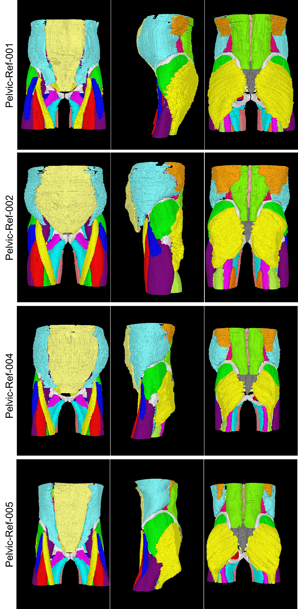

# Annotations for the Pelvic Reference Data (under construction)

Although various methods for musculoskeletal segmentation from medical images have been proposed,
quantitative and fair comparison is difficult due to the lack of a common data set.

The purpose of this repository is to manually annotate the musculoskeletal structures in the publicly available data set.

## Pelvic Reference Data [1]

This data set contains pelvic CT scans from 58 patients. The field of view is 512x512 mm^2. The slice interval is 3 mm.

```cite
[1] Afua A. Yorke, Gary C. McDonald,  David Solis Jr., Thomas Guerrero. (2019)
Pelvic Reference Data. The Cancer Imaging Archive.
DOI: 10.7937/TCIA.2019.woskq5oo
http://wiki.cancerimagingarchive.net/display/Public/Pelvic+Reference+Data
```

## Annotations
This repository attempts to annotate 24 muscle and 4 bone structures.

Note that currently only 4 patients were annotated.



## Usage
### Download CT scans from TCIA
see the `./.temp/TCIA-Pelvic-Reference-Data-SimCT.tcia`

### Convert DICOM files
```bash
python ./scripts/convert_dicom_to_mhd.py
```
see the `volumes`

### Annotation files
see the `annotations`


## Acknowledgement
- [画像診断cafe](http://medicalimagecafe.com/tool/abdominal/01.html)
